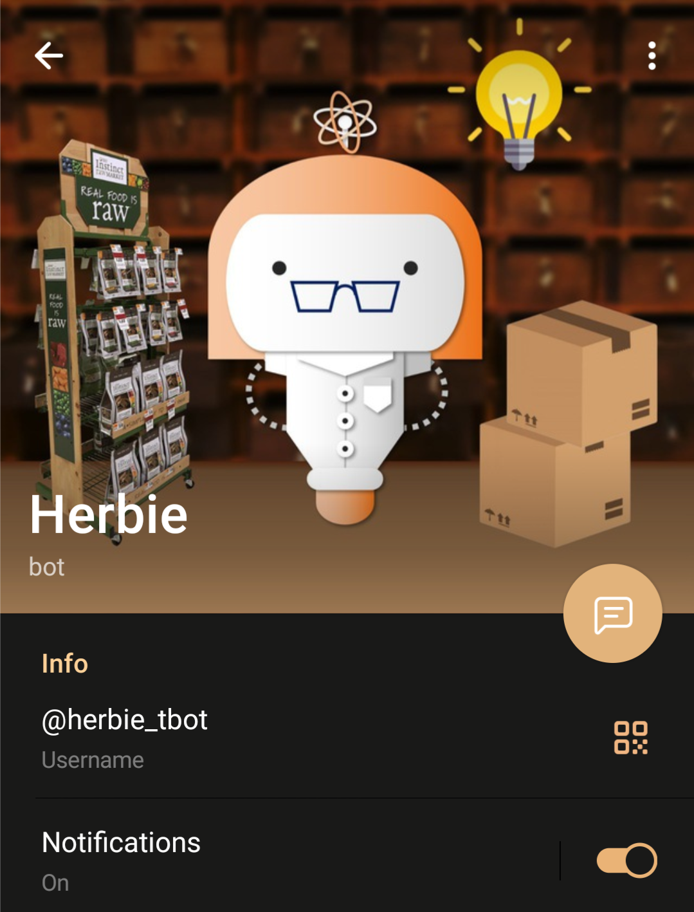

# Herbie_Tbot
Repo containing the companion Telegram Bot for *Herbie*, my final project for the Human-Machine Dialogue course 2021-22 at University of Trento.

The demo video for Herbie Telegram Bot can be found at this [link](https://youtu.be/ElItrBWbHqg).



---

## Software requirements
Herbie Telegram Bot has been developed in an **[Ubuntu](https://ubuntu.com/) 20.04 LTS** environment.

She makes use of the following software:
* [python](https://www.python.org/downloads/) 3.8.10
* [python-telegram-bot](https://github.com/python-telegram-bot/python-telegram-bot) 13.11
* [psycopg2-binary](https://pypi.org/project/psycopg2/) 2.9.3
* [pandas](https://pandas.pydata.org/) 1.3.4
* [xlsxwriter](https://xlsxwriter.readthedocs.io/) 3.0.3
* [Pillow](https://pypi.org/project/Pillow/) 8.4.0
* [pyzbar](https://pypi.org/project/pyzbar/) 0.1.9
* [openpyxl](https://pypi.org/project/openpyxl/) 3.0.9
* [pytz](https://pypi.org/project/pytz/) 2021.3


She makes also use of the following built-in Python libraries: *PIL, random, configparser, datetime, logging, json, os, time.*

---

## Repo structure
Herbie Telegram Bot's repo is structured as follows:

```
Herbie_Tbot
├── data_cache                      #target directory for temporary files
│   └── setfolder.ini
├── database                        #DB creation, administration & interaction functions
│   ├── __init__.py
│   ├── admin_tools.py
│   ├── db_export.py
│   ├── db_interactor.py
│   └── db_tools.py
├── logs                            #logging directory
│   ├── db_events.log
│   ├── tbot_events.log
│   └── setfolder.ini
├── res                            #logging directory
│   └── Herbie_Tbot.png            #Herbie profile picture
├── __init__.py
├── Aptfile
├── bot.py                          #main Bot file
├── bot_functions.py                #helper functions
├── globals.py                      #key global parameters and imports
├── local_tbot_credentials.ini      #needed file for the connection to the DB, to Heroku and to the Telegram service
├── Procfile
├── requirements.txt                #dependencies
└── README.md
```

---

## Use Herbie Telegram Bot
Herbie is live on Telegram at the following link: https://t.me/herbie_tbot. This is a **companion Bot** for *Herbie Vocal*, needed only for the tasks that cannot be performed by voice (i.e. insert/update DB data, receive printable files).

Her Bot is hosted on [Heroku](https://www.heroku.com/) free tier: she is available 24h, but she may initially answer after 1 minute when contacted (due to the virtual “Dyno” turning back on). 

### Register first!
In order to use Herbie Telegram Bot, you need to **register** first. Open the Telegram Bot and run the command:
```
/registrami
```
Then, insert the passcode ("OTP") you received from the admin.

### Command list
Herbie Telegram Bot contains the following commands:
* **“/aggiorna”**:
    * Register a new Product into the database or update information of a Product already registered
    * Register a Supplier or update its information
    * Register a Category or update its information:
    * DB cleaning (delete products, suppliers and categories with 0 pieces)
* **“/vista”**: manually download printable views of the warehouse (Excel format):
    * Warehouse inventory view (all or one supplier only)
    * Recap view with the total inventory quantity and value by supplier / category
    * An order list (in progress or definitive)
* **“/registrami”**:
    * Needed only once, to authorize the user to the use of the Herbie Telegram Bot (as explained above).

Furthermore, Herbie Telegram Bot works as a **receiver** for any printable warehouse view that is requested via Alexa to *Herbie Vocal*.
